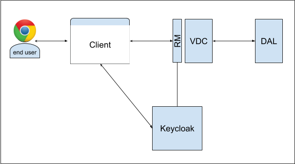

 # DITAS  VDC Access Control  Example
This project aims to simulated testbed (dummy example) of the DITAS runtime environment to demonstrate how Access Control is managed in the DITAS Project.

All elements of this project are just mock versions of the final runtime (VDC, app, databases) and can be used to simulate other components, e.g., monitoring.

This example represents a snapshot of an already deployed VDC with a mock DAL and one application connected ot the vdc.


### Usage:
All components can be build and run via docker-compose. The current version was tested on Windows and Ubuntu  with Docker version 18.09 and docker-compose version 1.17.1.


### System Requirmentes:
In order to run our example your docker enviroment needs to have at least 4 GB of system memory. If you are running Docker for Windows, make sure to change the setting of the docker vm, otherwise some containers might not start or terminate unexpectily. 

We recommend using docker version:
```
$docker --version
Docker version 18.09.4, build d14af54266
``` 
or higher, and docker compose version:
```
$docker-compose --version
docker-compose version 1.17.1 
``` 
or higher.

### Running the Example:
To start the containers for the above choosen scenario use the following command: 

```docker-compose up ``` 


This will also build the necessary parts for the containers before starting them. 

##### UPDATE
If you want to update the sources from github:
 - stop the containers first (Ctrl + C)
 - pull the new sources from github (```git pull```)
 - remove the containers (```docker-compose rm```)
 - rebuild and start the containers (```docker-compose up --build```)

### Available Components:
* VDC running at port 8282
* APP Client running at port 3000
* Request-Monitor running at port 8888
* DAL with no exoposed ports
* Keycloak running at port 4444

### Manual Keycloak Configuration

If you want to manually configure Keycloak visit the landing Page of Keycloak served at port 4444. There you can move to the admin console, the default user is `` admin`` with the password ``UVhDKCuoQGMAMNAEBWH2gkU0JJR8DnXT``, the password can be set in the docker-compose.yml. NOTE if you dont set a Password in the docker-compose.yml the setup will generate one for you, it can be found in the console output of the projject.